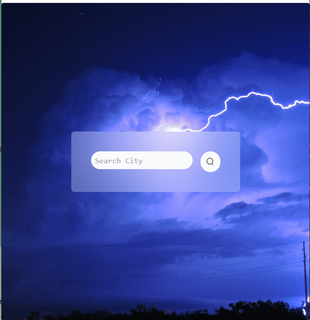
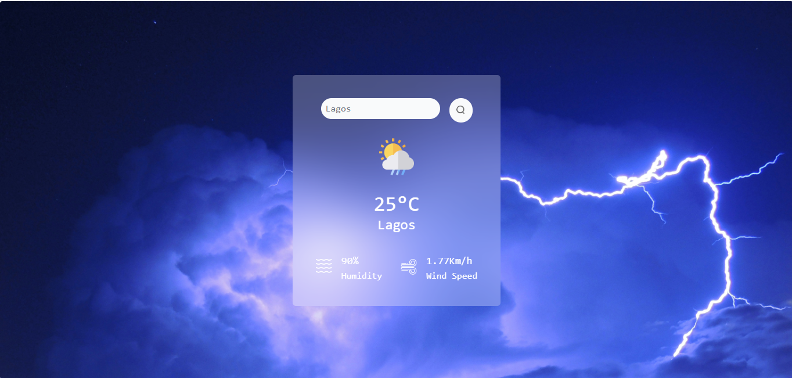

# Weather App with OpenWeatherMap API

## Overview

This project is part of the Codevixens 10 Days of Frontend Challenge (Day 6). This weather web application was built using Vite React and styled with TailwindCSS. The task focuses on mastering  state management, event handling and UI design in ReactJS.

## Features

- **State Management:** React's **useState**  hook were used to manage input city and fetched weather data.
- **API Integration:** Fetches weather data from the OpenWeatherMap API.
- **User Interface:**  UI designed using TailwindCSS that allows the user view requested city's weather.

## Installation

1. Clone the repository: ```javascript git clone https://github.com/Nkwor-Jane/weather-app.git```

2. Navigate to the project directory: ```javascript cd weather-app```

3. Install dependencies:```javascript npm install```

## Usage

1. Start the development server: ```javascript npm run dev```

2. Open your browser and navigate to: ```javascript http://localhost:5173/```

## How it Works

1. **Input Fields:** Enter the city.
2. **Search Button:** Click search button to to get city's weather details.
3. **Display:** The city's weather, humidity and wind speed will be displayed.

## Screenshots

- Before input
  


- After input


## Live Demo

Check out the live demo [here](https://weather-app-gules-mu.vercel.app/).

## Contirbuting

Feel free to clone and fork this repository. You can also submit pull requests. Any contributions are welcome!

## License

This project is licensed under the MIT License

## Acknowledgements

- [Codevixens](https://codevixens.org/) for organizing this challenge.
- Lois Bassey, Chinaza Igboanugo, Gaelle Tiku Brenda - and Oyakinsola Shoroye for their contributions and guidance towards the successful completion of this projects.

Feel free to customize it further to fit your needs! If you have any specific details you'd like to add or change, let me know.
